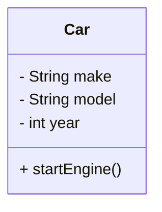
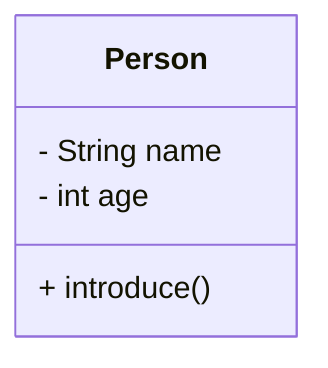
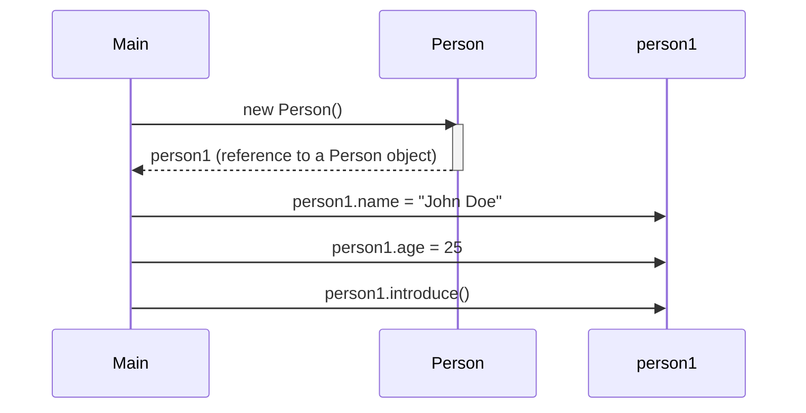
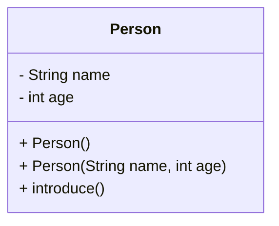
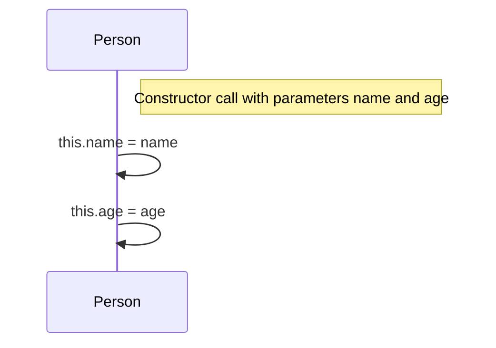
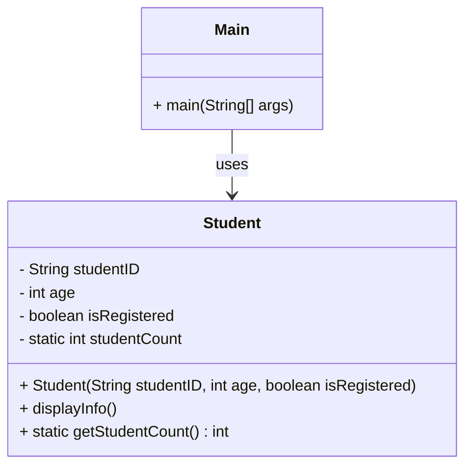

# Java Classes and Objects Lab

## Agenda

1. [Introduction](#1-introduction)
2. [Defining Classes](#2-defining-classes)
3. [Creating Objects](#3-creating-objects)
4. [Constructors](#4-constructors)
5. [The `this` Keyword](#5-the-this-keyword)
6. [Static Fields and Methods](#6-static-fields-and-methods)
7. [Overriding the `toString()` Method](#7-overriding-the-tostring-method)
8. [Summary and Further Reading](#8-summary-and-further-reading)

---

## 1. Introduction

### Explanation

Object-Oriented Programming (OOP) is a powerful programming paradigm that organizes code around "objects" rather than actions and data.  Instead of focusing on procedures (like in procedural programming), OOP emphasizes *objects* which encapsulate both data (attributes or fields) and the actions that can be performed on that data (methods or functions).  This approach offers several key advantages:

* **Modularity:**  Code is broken down into reusable objects, making it easier to manage, understand, and maintain large projects.  Changes to one object are less likely to affect others.
* **Reusability:** Objects can be reused in different parts of a program or even in different projects.
* **Maintainability:** The modular nature makes debugging and updating code significantly easier.
* **Scalability:** OOP principles help build programs that can easily handle increasing amounts of data and complexity.


In Java, OOP is implemented through the use of *classes* and *objects*.

**Key Concepts:**

- **Classes:**  Think of a class as a blueprint or template. It defines the *structure* (what data an object will hold, represented by fields/attributes/member variables) and *behavior* (what actions an object can perform, represented by methods/functions/member methods) of objects.  It's a description of *what* an object will be.

- **Objects:** Objects are the concrete instances of a class. They are the actual things created based on the class's blueprint.  An object holds specific values for the fields defined in its class and can execute the methods defined in that class.  It's an *instance* of a class.  For example, you could have a `Car` class as a blueprint, and then create many different `Car` *objects*, each representing a specific car with its own make, model, and year.


### Example

Consider a simple `Car` class that defines the blueprint for a car object.

```java
public class Car {
  // Fields (attributes)
  String make;
  String model;
  int year;
   
  // Methods (behaviors)
  public void startEngine() {
    System.out.println("Engine started.");
  }
}
```

### UML Diagram for Car class



### DIY Coding Task

**Objective**: Think about real-world objects and how they can be represented as classes in Java.  Consider attributes (what describes the object) and behaviors (what the object can do).

**Task**:

1. Create a package named `ie.atu.classesandobjects`. All classes you create for this lab below will go in here.

---

## 2. Defining Classes

### Explanation

In Java, a class is defined using the `class` keyword, followed by the class name, and enclosed in curly braces `{}`.  Inside the curly braces, you declare the fields (data) and methods (behavior) that define the class.  The `public` keyword means this class is accessible from anywhere.  You'll learn about other access modifiers (like `private`, `protected`) later.

**Syntax:**

```java
public class ClassName {
  // Fields (instance variables) - data the object holds
  data_type field1;
  data_type field2;
  // ... more fields

  // Methods (member methods) - actions the object can perform
  return_type method1(parameters) {
    // method body
  }
  return_type method2(parameters) {
    //method body
  }
  // ... more methods
}
```

### Example

Let's define a `Person` class with some attributes and methods.

```java
public class Person {
  // Fields
  String name;
  int age;

  // Methods
  public void introduce() {
    System.out.println("Hi, I'm " + name + " and I'm " + age + " years old.");
  }
}
```

### Mermaid Diagram



### DIY Coding Task

**Objective**: Create a `Student` class.  Remember to consider both attributes (like student ID, age, registration status) and behaviors (like displaying student information).

**Task**:

1. Define a class named `Student`.
2. Add fields: `String studentID`, `int age`, `boolean isRegistered`.
3. Write a method `displayInfo()` that prints the student's details.  Make sure the output is neatly formatted.

**Sample Output when `displayInfo()` is called**:

```
Student ID: S00123
Age: 20
Registered: true
```

---

## 3. Creating Objects

### Explanation

A class is just a blueprint; to actually use it, you need to create an *object* – an instance of the class.  This is done using the `new` keyword, followed by a call to the class's constructor (we'll cover constructors in detail next).

**Syntax:**

```java
ClassName objectName = new ClassName(); // Using the default constructor
```

or

```java
ClassName objectName = new ClassName(parameters); //Using a parameterized constructor (explained later)
```


This creates a new object of type `ClassName` and assigns its reference (memory address) to the variable `objectName`.  You can then access the object's fields and call its methods using the dot operator (`.`).

### Example

Using the `Person` class defined earlier, let's create an object.

```java
public class Main {
  public static void main(String[] args) {
    // Creating an object of Person class
    Person person1 = new Person(); //creates a new person object using the default constructor (assuming it exists).
    person1.name = "John Doe";
    person1.age = 25;

    // Calling the method
    person1.introduce(); // Output: Hi, I'm John Doe and I'm 25 years old.
  }
}
```

### Mermaid Diagram



### DIY Coding Task

**Objective**: Create an object of the `Student` class you defined in the previous section and use its methods.

**Task**:

1. In a `Main.java` file, write the `main` method (this is where your program execution starts).
2. Create an instance of `Student`:
  - Assign values to its fields (`studentID`, `age`, `isRegistered`).  This will require a default constructor, or setting the values after creating the object, as we did in the Person example.
3. Call the `displayInfo()` method to print the student's details.

---

## 4. Constructors

### Explanation

Constructors are special methods within a class that are automatically called when you create a new object using the `new` keyword.  They are used to initialize the object's fields to initial values.  They have the same name as the class and do *not* have a return type (not even `void`).

- **Default Constructor**: If you don't explicitly define any constructors, Java provides a default constructor that does nothing (sets fields to default values like 0 for numbers, `null` for strings, `false` for booleans).

- **Parameterized Constructor**: These allow you to pass values to the constructor when creating an object. This lets you initialize an object with specific values right from the start.


**Default Constructor Example:** (This is what the compiler would create implicitly if you don't define any constructors).

```java
public class Person {
  String name;
  int age;

  // Default constructor (implicitly provided if you define no constructors)
  //public Person(){}
}
```

**Parameterized Constructor Example:**

```java
public class Person {
  String name;
  int age;

  // Parameterized constructor
  public Person(String personName, int personAge) {
    name = personName;
    age = personAge;
  }
}
```

### Mermaid Diagram



### Example

Using the `Person` class with constructors.

```java
public class Main {
  public static void main(String[] args) {
    // Using default constructor (implicitly created by compiler, if you define no other constructors)
    Person person1 = new Person(); //This implicitly calls the parameterless constructor.
    person1.introduce(); // Output: Hi, I'm null and I'm 0 years old. (or similar, depending on the default values)

    // Using parameterized constructor
    Person person2 = new Person("Alice", 30);
    person2.introduce(); // Output: Hi, I'm Alice and I'm 30 years old.
  }
}
```

### DIY Coding Task

**Objective**: Add constructors to your `Student` class to properly initialize `Student` objects.

**Task**:

1. In your `Student` class, add:
  - A default constructor that sets reasonable default values for the fields (`studentID`, `age`, `isRegistered`).  For example, you might set `studentID` to "N/A".
  - A parameterized constructor that accepts `studentID`, `age`, and `isRegistered` as parameters and initializes the object's fields with those values.

2. Modify your `Main` class to:
  - Create a `Student` object using the default constructor and call `displayInfo()`.
  - Create another `Student` object using the parameterized constructor and call `displayInfo()`.

**Sample Output**:

```
Student ID: N/A
Age: 0
Registered: false

Student ID: S00234
Age: 22
Registered: true
```

---

## 5. The `this` Keyword

### Explanation

The `this` keyword is a reference to the current object instance. It's primarily used in two scenarios:

1. **Distinguishing between instance variables and parameters:** When a parameter's name is the same as an instance variable, `this` clarifies which one you're referring to.

2. **Calling other constructors (constructor chaining):**  `this()` can be used inside a constructor to call another constructor of the same class.  This reduces redundancy, particularly if you have several constructors with similar initialization steps.

**Example Usage (Scenario 1):**

```java
public class Person {
  String name;
  int age;

  public Person(String name, int age) {
    this.name = name; // 'this.name' refers to the class field; 'name' refers to the constructor parameter
    this.age = age;
  }
}
```

**Example Usage (Scenario 2): Constructor Chaining**

```java
public class Person {
    String name;
    int age;
    String city;

    public Person(String name, int age) {
        this(name, age, "Unknown"); //calls the constructor below
    }

    public Person(String name, int age, String city) {
        this.name = name;
        this.age = age;
        this.city = city;
    }
}
```


### Mermaid Diagram



### Example

Implementing the `this` keyword in the `Student` class (showing both uses).

```java
public class Student {
  String studentID;
  int age;
  boolean isRegistered;

  // Default constructor using this() to call parameterized constructor
  public Student() {
    this("N/A", 0, false);
  }

  // Parameterized constructor using 'this'
  public Student(String studentID, int age, boolean isRegistered) {
    this.studentID = studentID;
    this.age = age;
    this.isRegistered = isRegistered;
  }

  public void displayInfo() {
    System.out.println("Student ID: " + this.studentID);
    System.out.println("Age: " + this.age);
    System.out.println("Registered: " + this.isRegistered);
  }
}
```

### DIY Coding Task

**Objective**: Practice using the `this` keyword in constructors and methods.

**Task**:

1. Update your `Student` class:
  - Ensure that both constructors use the `this` keyword to refer to class fields where appropriate.
  - In the default constructor, call the parameterized constructor using `this(...)` for constructor chaining.
2. Use `this` in the `displayInfo()` method where appropriate (though it's not strictly necessary here).
3. Verify that your program still works as expected.

---

## 6. Static Fields and Methods

### Explanation

Static members (fields and methods) belong to the *class itself*, not to any specific object instance of the class.  There's only one copy of a static member, shared by all objects of that class.

- **Static Fields (Class Variables):** These are useful for tracking things related to the class as a whole (like a counter of how many objects have been created).

- **Static Methods:** These can be called directly on the class name (without creating an object). They often perform utility functions related to the class.  They *cannot* access instance variables directly because they don't belong to any specific object.


**Key Points:**

- Use the `static` keyword to declare static fields or methods.
- Static methods cannot directly access instance variables (non-static fields) – they only have access to static members.


### Example

#### Counting Instances with a Static Field

Let's modify the `Student` class to keep track of the total number of `Student` objects created.

```java
public class Student {
  // Instance Fields
  String studentID;
  int age;
  boolean isRegistered;

  // Static Field (class variable)
  static int studentCount = 0;

  // Parameterized constructor using 'this'
  public Student(String studentID, int age, boolean isRegistered) {
    this.studentID = studentID;
    this.age = age;
    this.isRegistered = isRegistered;
    studentCount++; // Increment static counter
  }

  public void displayInfo() {
    System.out.println("Student ID: " + this.studentID);
    System.out.println("Age: " + this.age);
    System.out.println("Registered: " + this.isRegistered);
  }

  // Static Method (class method)
  public static int getStudentCount() {
    return studentCount;
  }
}
```

#### Main.java

```java
public class Main {
  public static void main(String[] args) {
    Student s1 = new Student("S001", 20, true);
    Student s2 = new Student("S002", 22, false);
    Student s3 = new Student("S003", 21, true);

    // Display individual student info
    s1.displayInfo();
    s2.displayInfo();
    s3.displayInfo();

    // Access static field via class name
    System.out.println("Total Students: " + Student.getStudentCount());
  }
}
```

**Sample Output:**

```
Student ID: S001
Age: 20
Registered: true
Student ID: S002
Age: 22
Registered: false
Student ID: S003
Age: 21
Registered: true
Total Students: 3
```

### Mermaid Diagram



### DIY Coding Task

**Objective**: Practice using static fields and methods.

**Task**:

1. Modify your `Student` class:
  - Add a static field `studentCount` to keep track of the number of `Student` instances.
  - Increment `studentCount` in each constructor.
  - Add a static method `getStudentCount()` that returns the value of `studentCount`.
2. Update your `Main` class:
  - Create multiple `Student` objects.
  - After creating them, print out the total number of students using `Student.getStudentCount()`.


---

## 7. Overriding the `toString()` Method

### Explanation

The `toString()` method in Java is used to provide a string representation of an object. When you print an object, Java internally calls the `toString()` method to get its string form. By default, the `toString()` method in the `Object` class returns the class name followed by the object's hashcode, but you can override this method to provide a more meaningful representation of your object.

### Demo: Overriding `toString()` in the `Book` Class

Let’s implement the `Book` class and override the `toString()` method to display its details neatly.

```java
public class Book {
    private String title;
    private String author;
    private int pages;

    // Constructor
    public Book(String title, String author, int pages) {
        this.title = title;
        this.author = author;
        this.pages = pages;
    }

    // Overriding toString()
    @Override
    public String toString() {
        return "Book: " + title + " by " + author + " (" + pages + " pages)";
    }
}
```

Now, let’s test this in the `Main` class.

```java
public class Main {
    public static void main(String[] args) {
        // Create a Book object
        Book book1 = new Book("The Hobbit", "J.R.R. Tolkien", 310);

        // Print the book object
        System.out.println(book1);  // Output: Book: The Hobbit by J.R.R. Tolkien (310 pages)
    }
}
```

### DIY Coding Task: Overriding `toString()` in the `Student` Class

**Objective**: Build upon the `Student` class from previous sections. Override the `toString()` method to provide a meaningful string representation of the student's details.

**Task**:

1. In the `Student` class, override the `toString()` method.
2. The output should display the `studentID`, `age`, and `isRegistered` fields in a neat format.

**Sample Output when printing a `Student` object**:

```
Student: ID = S00234, Age = 22, Registered = true
```

---

## 8. Summary and Further Reading

This lab provided a comprehensive introduction to fundamental object-oriented programming concepts in Java.  You learned how to:

- Define classes and their members (fields and methods)
- Create objects using constructors
- Use the `this` keyword to differentiate between instance variables and parameters, and for constructor chaining
- Use static fields and methods to represent class-level information and behavior
- Override the `toString()` method to provide custom string representations


### Further Reading

**(Links updated and categorized for better clarity)**

**Official Java Documentation:**

* [Java Tutorials - Classes and Objects](https://docs.oracle.com/javase/tutorial/java/javaOO/classes.html)
* [The `this` Keyword](https://docs.oracle.com/javase/tutorial/java/javaOO/thiskey.html)
* [Class Members](https://docs.oracle.com/javase/tutorial/java/javaOO/classvars.html)
* [Method Overriding](https://docs.oracle.com/javase/tutorial/java/IandI/override.html)


**Recommended Books:**

* *Head First Java* by Kathy Sierra & Bert Bates (Excellent for beginners)


**Online Resources (More beginner-friendly options):**

* **Constructors:** [W3Schools Java Constructors](https://www.w3schools.com/java/java_constructors.asp)
* **Static Keyword:** [W3Schools Java Static Keyword](https://www.w3schools.com/java/java_class_members.asp)
* **`this` Keyword:** [GeeksforGeeks - `this` Keyword in Java](https://www.geeksforgeeks.org/this-reference-in-java/)
* **`toString()` Method:** [GeeksforGeeks - Overriding `toString()` Method](https://www.geeksforgeeks.org/overriding-tostring-method-in-java/)


---

**Congratulations!** You've completed the lab. Remember to continue practicing to solidify your understanding.  The next steps in your OOP journey will involve exploring inheritance, polymorphism, and interfaces.  Happy coding!

---

# End of Lab
